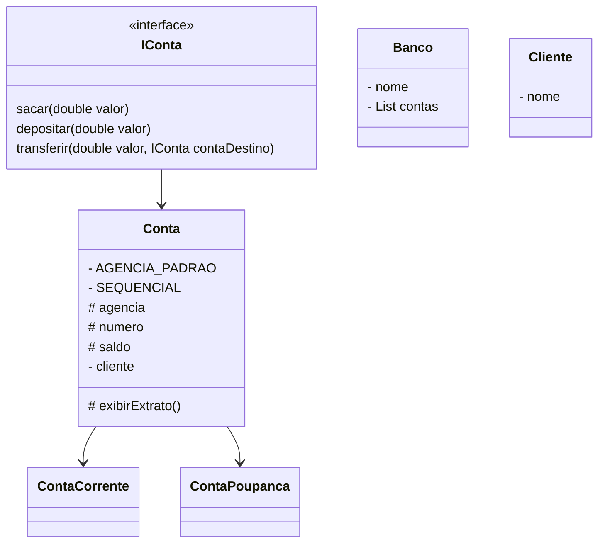

# Criando um Banco Digital com Java e Orientação a Objetos

Desafio de criar um banco para praticar os 4 pilares da programação orientada a objetos:
- `Abstração` : Habilidade de concentrar-se nos aspectos essenciais de um domínio, ignorando características menos importantes ou acidentais. Nesse contexto, objetos são abstrações de entidades existentes no domínio em questão.

- `Encapsulamento` :  esconder a implementação dos objetos, criando assim interfaces de uso mais concisas e fáceis de usar/entender. O encapsulamento favorece principalmente dois aspectos de um sistema: a manutenção e a evolução.

- `Herança` : Permite que você defina uma classe filha que reutiliza (herda), estende ou modifica o comportamento de uma classe pai. A classe cujos membros são herdados é chamada de classe base. A classe que herda os membros da classe base é chamada de classe derivada.

- `Polimorfismo` : Capacidade de um objeto poder ser referenciado de várias formas, ou seja, é capacidade de tratar objetos criados a partir das classes específicas como objetos de uma classe genérica. Cuidado, polimorfismo não quer dizer que o objeto fica se transformando, muito pelo contrário, um objeto nasce de um tipo e morre daquele tipo, o que pode mudar é a maneira como nos referimos a ele.

## Fluxograma

